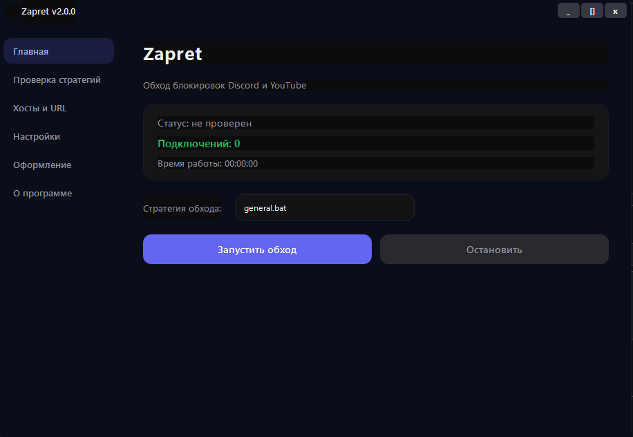
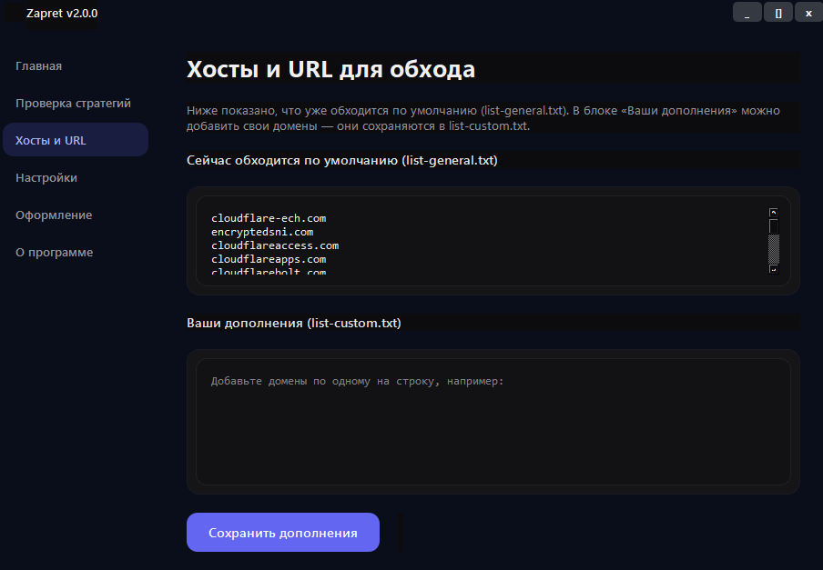
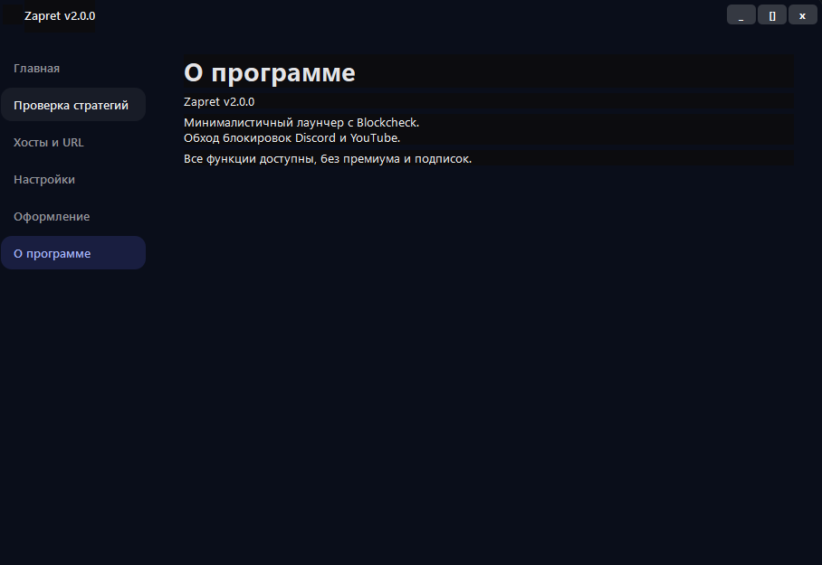
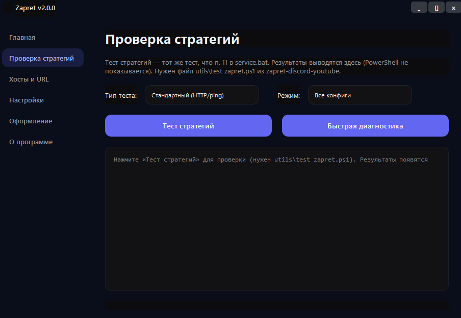
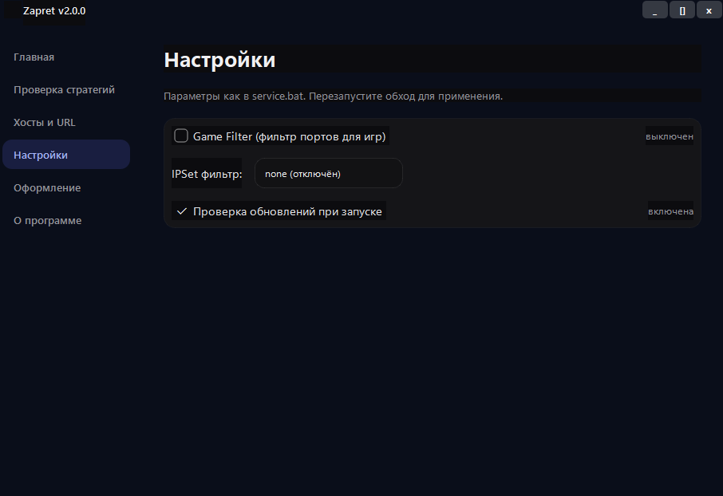

# 🚀 Zapret GUI

**Zapret GUI** is a lightweight Windows application for  
**network configuration, strategy testing, host & URL management and DPI bypass / compatibility optimization.**

Designed for advanced connection handling and DPI traffic filtering scenarios.

---

## ✨ Features
- 🎨 **Clean Dark Interface**
- 🧪 **Strategy Testing System**
- 🌐 **Host & URL Management**
- 🖌 **Theme Customization**
- ⚡ **Lightweight & Fast**
- 🔓 **DPI Bypass & Traffic Compatibility**
- 🆓 **No Subscriptions**

---

## 🖼 Screenshots

### Main Window

### Strategy Testing

### Hosts & URL

### Settings

### Themes

### About

---

## 📦 Installation
1. Open **Releases**
2. Download the latest `.exe`
3. Run application
4. Select strategy and start

---

## 🔒 Safety
- ❌ No data collection  
- ❌ No ads  
- ❌ No background services  
- ✔ Portable application  

---

## 🗺 Roadmap
- UI animations
- Auto-update system
- Linux version

---

# 🇷🇺 Русская версия

**Zapret GUI** — минималистичная программа для Windows  
с графическим интерфейсом для настройки сети, тестирования стратегий подключения  
и **обхода / совместимости DPI-фильтрации**.

---

## ⚙ Возможности
- 🎨 Аккуратный тёмный интерфейс  
- 🧪 Проверка стратегий подключения  
- 🌐 Управление доменами и URL  
- 🖌 Выбор тем оформления  
- ⚡ Быстрый запуск  
- 🔓 Обход и совместимость DPI  
- 🆓 Без подписок и рекламы  

---

## 📥 Установка
1. Перейти в раздел **Releases**
2. Скачать `.exe`
3. Запустить файл
4. Выбрать стратегию и начать работу

---

## 🔐 Безопасность
- Нет сбора данных  
- Нет фоновых сервисов  
- Нет рекламы  
- Портативное приложение  
